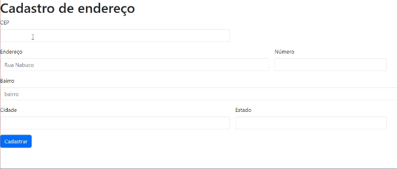

# (👉ﾟヮﾟ)👉 **Introdução** _Form-CadEndereco_

Este é um projeto de página web com um formulário de **"Cadastro de Endereço"**. A página utiliza ``HTML 5``, ``CSS 3`` e a biblioteca [``Bootstrap 5.3``](https://getbootstrap.com/docs/5.0/getting-started/introduction/) para criar uma interface de usuário amigável. O formulário permite que os usuários insiram informações relacionadas a um endereço, como CEP, endereço, número, bairro, cidade e estado.

**_Utilidade:_** Este projeto pode ser útil em diversos contextos, como cadastros de clientes, entregas, ou qualquer outra aplicação que envolva informações de endereço.

# 🔨🧐 **Funcionalidades** 

**Preenchimento do Formulário:** Os usuários podem interagir preenchendo os campos do formulário.

 **Os campos incluem:**

+ ``CEP:`` Os usuários podem inserir o CEP do endereço desejado.

+ ``Endereço:`` O campo permite a inserção do nome da rua, avenida ou localização.

+ ``Número:`` Os usuários podem especificar o número do imóvel, se aplicável.

+ ``Bairro:`` É possível inserir o nome do bairro.

+ ``Cidade:`` Os usuários podem informar a cidade do endereço.

+ ``Estado:`` Este campo oferece uma lista suspensa (dropdown) para a seleção do estado correspondente.

#  **Tecnologias utilizadas** 
[<code></code>](https://developer.mozilla.org/pt-BR/docs/Web/HTML)
[<code></code>](https://developer.mozilla.org/pt-BR/docs/Web/CSS)
[<code></code>](https://developer.mozilla.org/pt-BR/docs/Web/JavaScript)

[<code></code>](https://github.com/)
[<code></code>](https://code.visualstudio.com/)

``HTML 5:`` O HTML foi usado neste projeto para criar a estrutura e o conteúdo da página da web.

``CSS 3:`` O CSS foi usado neste projeto para estilizar e melhorar a apresentação visual da página.

``JavaScript:`` O JavaScript foi usado neste projeto para adicionar funcionalidades interativas à página.

# ✍️(◔◡◔)  **Autor** 

[Danilo Felype Lima](https://github.com/DaniloFelype)

  
  

