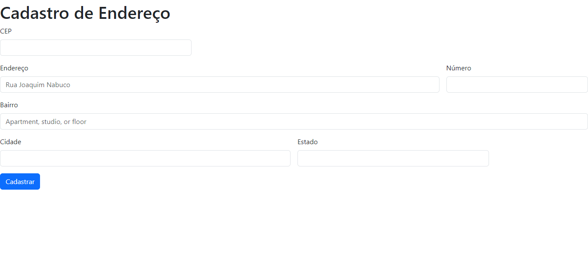

# Introdução _Form-CadEndereco_

Este é um projeto de página web com um formulário de **"Cadastro de Endereço"**. A página utiliza ``HTML``, ``CSS`` e a biblioteca ``Bootstrap`` para criar uma interface de usuário amigável. O formulário permite que os usuários insiram informações relacionadas a um endereço, como CEP, endereço, número, bairro, cidade e estado.

**Útilidade:** Este projeto pode ser útil em diversos contextos, como cadastros de clientes, entregas, ou qualquer outra aplicação que envolva informações de endereço.